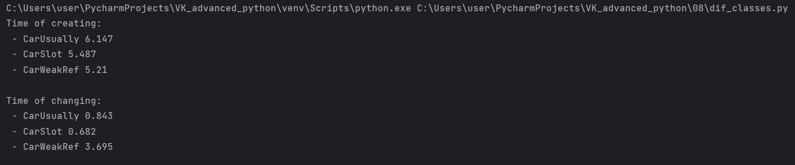
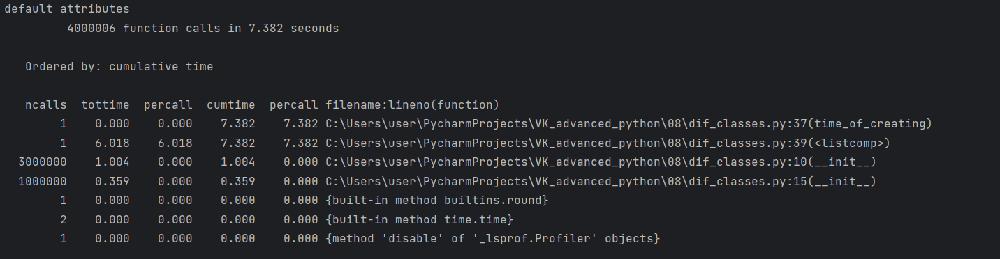
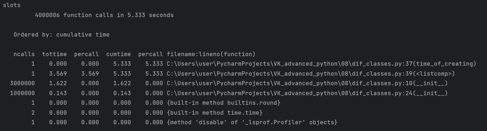
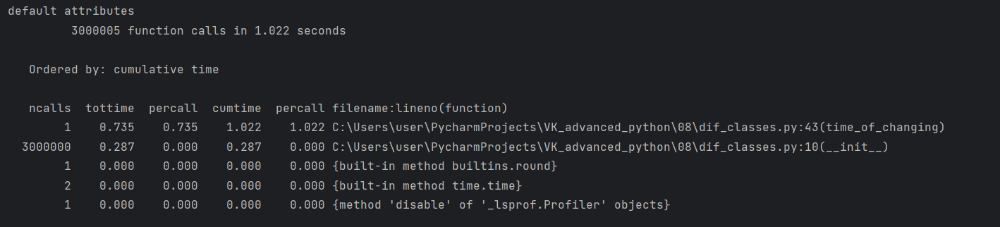
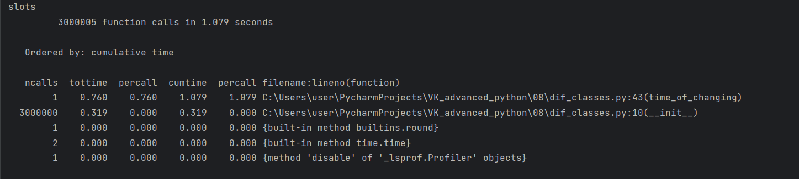
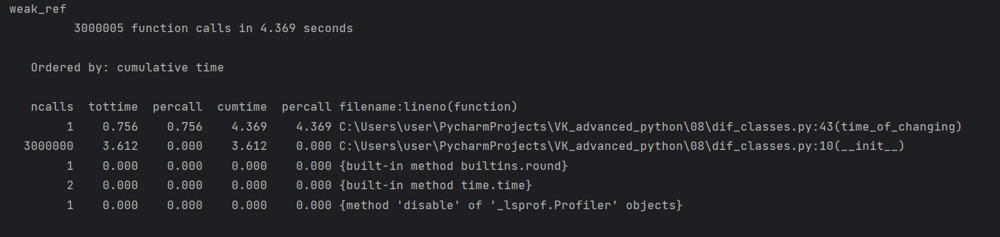
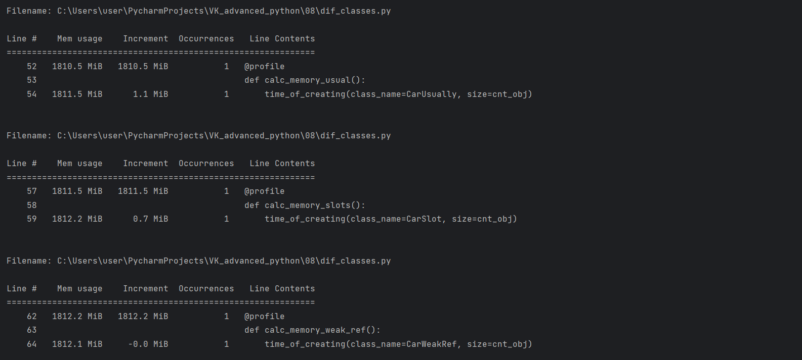
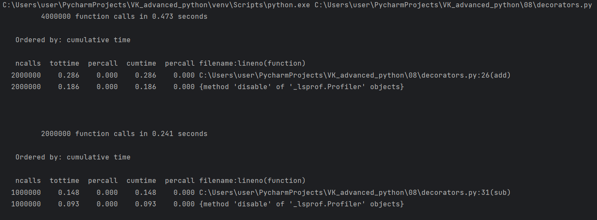

### 1. Сравнение использования weakref и слотов

У класса с обычными атрибутами время создания объектов дольше. Самый долгоизменяемый тип - тип со слабыми ссылками.

### 2. Профилирование
Профилирование вызовов

Профилирование памяти

### 3. Декоратор для профилирования

